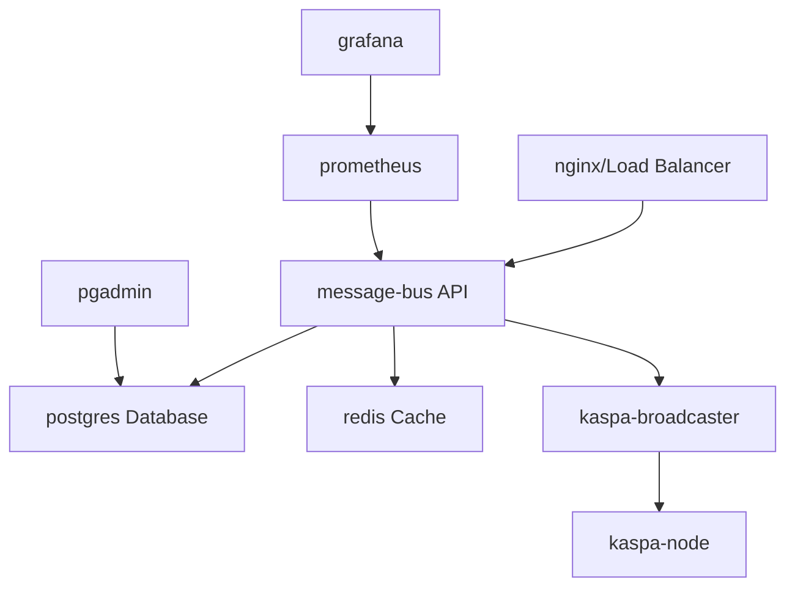

# 🐳 KMP Supply Chain - Docker Infrastructure

## **🚀 Enterprise-Ready Containerized Deployment**

This Docker setup provides a **complete production-ready environment** for the KMP Supply Chain blockchain anchoring system.

## **📦 Container Architecture**



## **🏗️ Services Included**

| Service | Container | Purpose | Port |
|---------|-----------|---------|------|
| **message-bus** | Node.js API | Core supply chain API | 4000 |
| **postgres** | PostgreSQL 15 | Primary database | 5432 |
| **redis** | Redis 7 | Session & cache store | 6379 |
| **kaspa-broadcaster** | Rust service | Blockchain submitter | - |
| **kaspa-node** | Kaspa testnet | Local blockchain node | 16110 |
| **prometheus** | Monitoring | Metrics collection | 9090 |
| **grafana** | Dashboards | System monitoring | 3000 |
| **pgadmin** | Database UI | DB administration | 5050 |

## **🚀 Quick Start**

### **1. Prerequisites**
```bash
# Install Docker & Docker Compose
curl -fsSL https://get.docker.com -o get-docker.sh
sh get-docker.sh

# Install Docker Compose
sudo curl -L "https://github.com/docker/compose/releases/latest/download/docker-compose-$(uname -s)-$(uname -m)" -o /usr/local/bin/docker-compose
sudo chmod +x /usr/local/bin/docker-compose
```

### **2. Clone & Setup**
```bash
git clone <your-repo>
cd kmp-cursor-export

# Create environment file
cp message_bus/.env.example message_bus/.env
# Edit with your secure values!
```

### **3. Launch Full Stack**
```bash
# Build & start all services
docker-compose up --build -d

# Check status
docker-compose ps

# View logs
docker-compose logs -f message-bus
```

### **4. Access Interfaces**
- **🌐 API**: http://localhost:4000
- **📊 Grafana**: http://localhost:3000 (admin/kmp_admin_2024)
- **📈 Prometheus**: http://localhost:9090
- **🗄️ pgAdmin**: http://localhost:5050 (admin@kmp.local/kmp_admin_2024)
- **📚 API Docs**: http://localhost:4000/docs

## **🔧 Environment Configuration**

### **Critical Variables to Set:**
```bash
# Security (CHANGE THESE!)
JWT_SECRET=your-super-secure-jwt-secret
POSTGRES_PASSWORD=your-secure-db-password
GRAFANA_ADMIN_PASSWORD=your-grafana-password

# Blockchain (KEEP SECURE!)
MASTER_WALLET_MNEMONIC="your twelve word mnemonic phrase here"
MASTER_WALLET_ADDRESS="kaspatest:your-wallet-address"
```

## **🛠️ Development Commands**

```bash
# Start for development
docker-compose up --build

# Rebuild specific service
docker-compose build message-bus
docker-compose up -d message-bus

# Database operations
docker-compose exec postgres psql -U kmp_user -d kmp_supply_chain
docker-compose exec message-bus npm run db:push

# View service logs
docker-compose logs -f [service-name]

# Stop all services
docker-compose down

# Clean everything (DESTRUCTIVE!)
docker-compose down -v --rmi all
```

## **🔄 Database Initialization**

The system automatically initializes with:
```bash
# Run database migrations
docker-compose exec message-bus npm run db:push

# Seed with test data (optional)
docker-compose exec message-bus npm run db:seed
```

## **🧪 Testing the Deployment**

### **Health Checks**
```bash
# System health
curl http://localhost:4000/health

# Database connectivity
curl http://localhost:4000/api/system/database

# Blockchain connectivity
curl http://localhost:4000/api/system/blockchain
```

### **End-to-End Test**
```bash
# Submit test event
curl -X POST http://localhost:4000/api/supply-chain/event \
  -H "Content-Type: application/json" \
  -d '{"productId":"DOCKER_TEST","location":"CONTAINER","eventType":"QUALITY_CHECK"}'
```

## **📊 Monitoring & Observability**

### **Grafana Dashboards**
- **System Overview**: CPU, Memory, Network
- **API Metrics**: Request rate, latency, errors
- **Database Performance**: Queries, connections
- **Blockchain Status**: Transaction rate, confirmations

### **Prometheus Metrics**
- Custom KMP metrics at `/metrics`
- Standard Node.js metrics
- PostgreSQL metrics
- Redis metrics

## **🔒 Security Best Practices**

### **Production Checklist:**
- [ ] Change all default passwords
- [ ] Use strong JWT secrets (32+ chars)
- [ ] Enable TLS/SSL certificates
- [ ] Configure firewall rules
- [ ] Set up log rotation
- [ ] Enable backup schedules
- [ ] Configure monitoring alerts

### **Secrets Management:**
```bash
# Use Docker secrets in production
echo "your-jwt-secret" | docker secret create kmp_jwt_secret -
echo "your-db-password" | docker secret create kmp_db_password -
```

## **🚨 Troubleshooting**

### **Common Issues:**

#### **Container Won't Start**
```bash
# Check logs
docker-compose logs [service-name]

# Check resource usage
docker stats

# Restart service
docker-compose restart [service-name]
```

#### **Database Connection Issues**
```bash
# Test PostgreSQL
docker-compose exec postgres pg_isready -U kmp_user

# Reset database
docker-compose down postgres
docker volume rm kmp-postgres-data
docker-compose up -d postgres
```

#### **Kaspa Node Sync Issues**
```bash
# Check sync status
docker-compose logs kaspa-node

# Reset blockchain data
docker-compose down kaspa-node
docker volume rm kmp-kaspa-data
docker-compose up -d kaspa-node
```

## **📈 Scaling for Production**

### **Horizontal Scaling:**
```yaml
# Scale API instances
message-bus:
  deploy:
    replicas: 3
    resources:
      limits:
        cpus: '1.0'
        memory: 1G
```

### **Load Balancing:**
```yaml
# Add nginx load balancer
nginx:
  image: nginx:alpine
  ports:
    - "80:80"  
    - "443:443"
  volumes:
    - ./nginx.conf:/etc/nginx/nginx.conf
```

## **🔄 Deployment Pipeline**

### **CI/CD Integration:**
```yaml
# .github/workflows/deploy.yml
- name: Deploy to Production
  run: |
    docker-compose -f docker-compose.prod.yml up -d --build
    docker-compose exec -T message-bus npm run db:migrate
```

## **💾 Backup & Recovery**

### **Database Backup:**
```bash
# Backup
docker-compose exec postgres pg_dump -U kmp_user kmp_supply_chain > backup.sql

# Restore
docker-compose exec -T postgres psql -U kmp_user kmp_supply_chain < backup.sql
```

### **Volume Backup:**
```bash
# Backup all volumes
docker run --rm -v kmp-postgres-data:/data -v $(pwd):/backup alpine tar czf /backup/postgres-backup.tar.gz -C /data .
```

---

## **🎯 Next Steps**

1. **✅ Docker Containerization** - COMPLETE
2. **⏭️ Kubernetes Manifests** - Deploy to K8s
3. **⏭️ Helm Charts** - Package management  
4. **⏭️ Terraform** - Infrastructure as Code
5. **⏭️ CI/CD Pipeline** - Automated deployment

**Your system is now enterprise-ready and containerized!** 🚀 